# Detection Documentation

This directory contains the Splunk detections built to identify the attack campaign investigated in this project. Each detection started as a manual search against the sample logs, was tuned against the actual attack data, and was then saved as a scheduled alert. The configuration screenshots below are taken directly from that process, not recreated afterward.

## Detection Catalog

| Detection Name | MITRE ATT&CK Technique | Log Source | SPL File | Severity | Triage Notes |
| :--- | :--- | :--- | :--- | :--- | :--- |
| **Firewall Brute Force Success** | T1110.004, TA0001 | Firewall | [firewall-bruteforce-alert.spl](Firewall/Alert/firewall-bruteforce-alert.spl) | High | Correlate the source IP against Windows and Linux authentication logs for the same time window. |
| **Windows RDP Brute Force** | T1110.001 | Windows | [windows-bruteforce-alert.spl](Windows/Alert/windows-bruteforce-alert.spl) | Medium | Confirm whether the account has a lockout policy enabled, and check for a successful login following the failures. |
| **Windows Admin Login from External IP** | T1078.002 | Windows | [windows-admin-external-alert.spl](Windows/Alert/windows-admin-external-alert.spl) | Critical | Treat as an active incident. Verify whether the login was authorized before assuming credential theft. |
| **Linux SSH Brute Force** | T1110.003 | Linux | [linux-ssh-bruteforce-alert.spl](Linux/Alert/linux-ssh-bruteforce-alert.spl) | Medium | Identify the targeted account and check whether any of the failed attempts were followed by a success. |

Two additional detections, privileged account monitoring on Windows and a targeted check for root account compromise on Linux, were built during the investigation phase rather than as standing alerts. Those queries live in the `Investigations` folder and are documented there, since they were written to answer a specific question about the attack rather than to run on a schedule.

## How Each Detection Was Built

Each one started from a simple question about the sample logs: is there a pattern here that a real analyst would need to be told about automatically, instead of finding by chance during a manual review.

**Firewall Brute Force Success.** The firewall logs record every denied and allowed connection. The query looks for five or more denied connections to SSH (port 22) or RDP (port 3389) from the same source within a 10-minute window. That threshold was set after reviewing the sample data, where the attacker's failed attempts consistently clustered well above that number before the successful connection came through.

**Windows RDP Brute Force.** Windows Event ID 4625 records a failed logon. The query groups failed logons by account and source IP in 10-minute windows and flags any account with five or more failures in that span. This is the most common alert type in the catalog and was intentionally kept at Medium severity, since a string of failed logons alone does not confirm compromise.

**Windows Admin Login from External IP.** This one is narrower and more serious by design. It filters Windows Event ID 4624 (successful logon) down to accounts containing "admin" and excludes any source IP in the internal 192.168.0.0/16 range. An administrative account authenticating from outside the network has very few legitimate explanations, which is why this detection is rated Critical rather than tuned with a threshold like the brute-force detections.

**Linux SSH Brute Force.** The Linux authentication logs record each failed SSH attempt with the process name `sshd`. The query bins failed attempts into 10-minute windows by source IP and flags five or more in a window. This detection is what first surfaced the attacker's use of non-standard ports, described in the Linux investigation write-up.

## Screenshots

Each detection below shows the search that was run, the results it returned against the sample data, and the alert configuration it was saved as.

### Firewall Brute Force Success

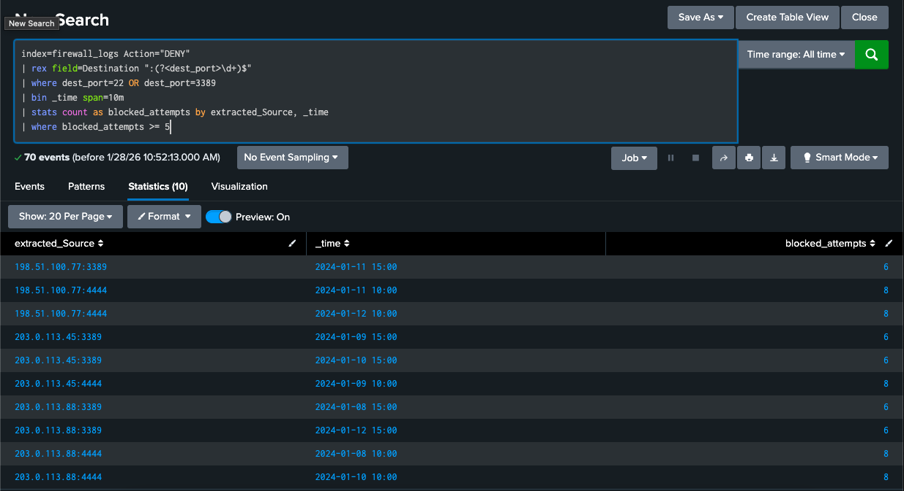
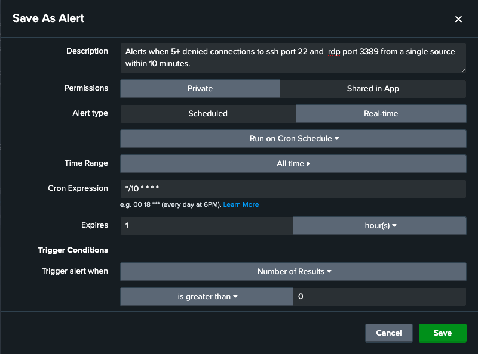
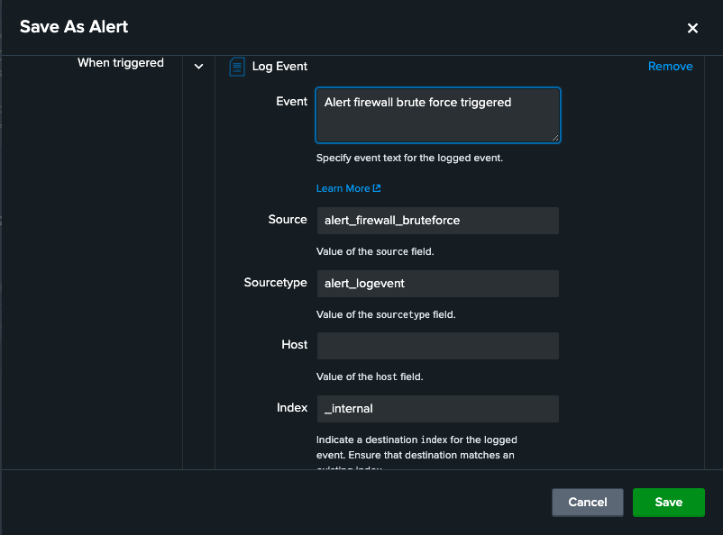

### Windows RDP Brute Force

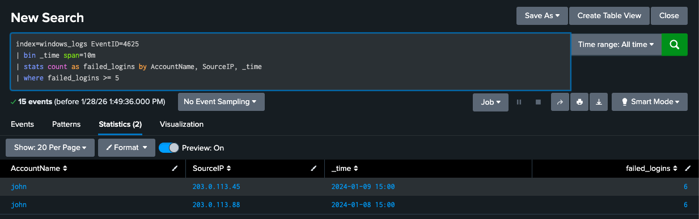
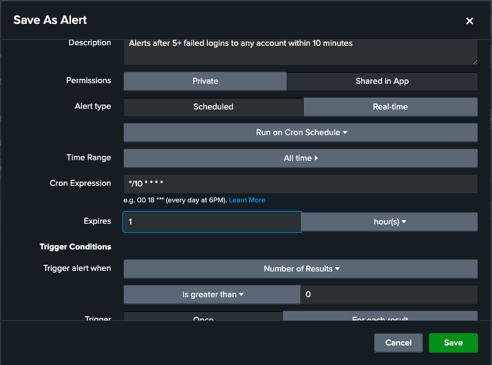
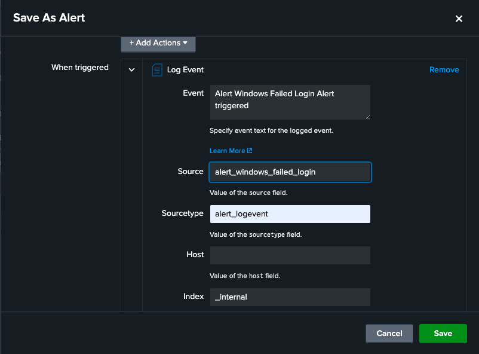

### Windows Admin Login from External IP

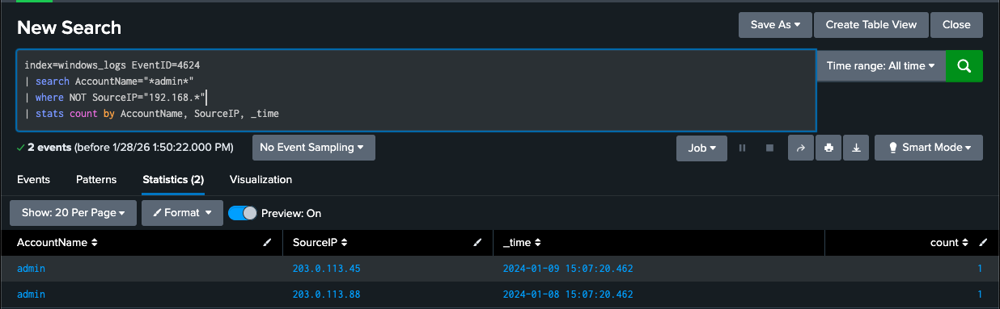
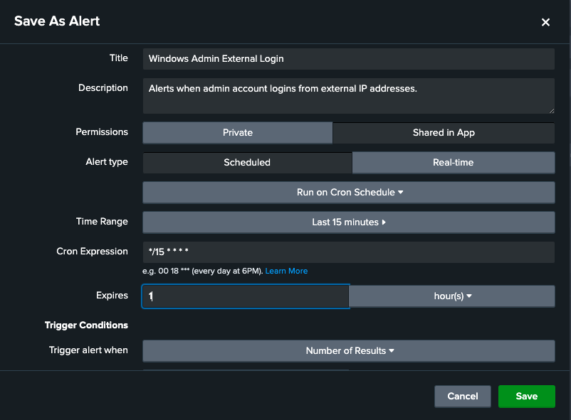
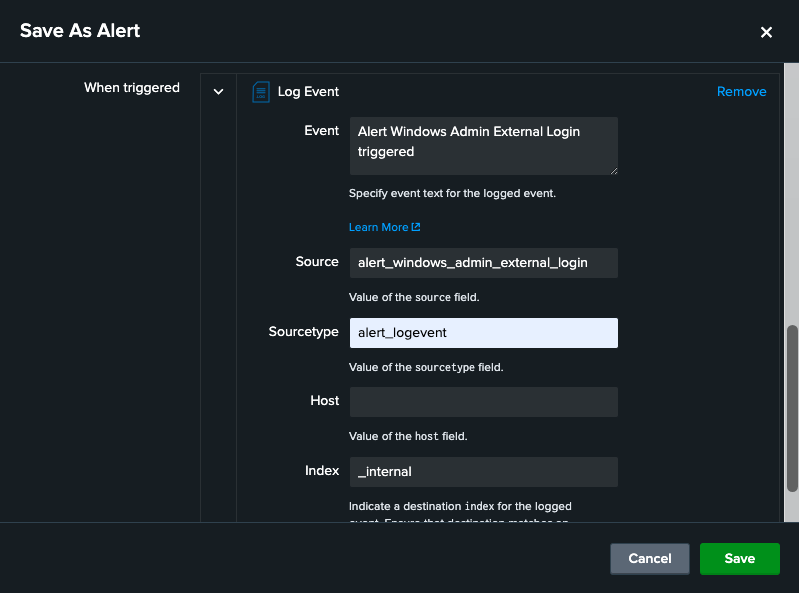

### Linux SSH Brute Force

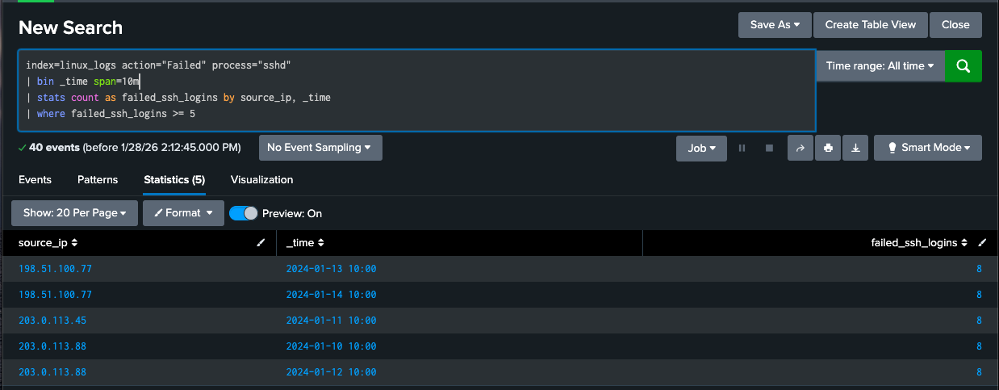
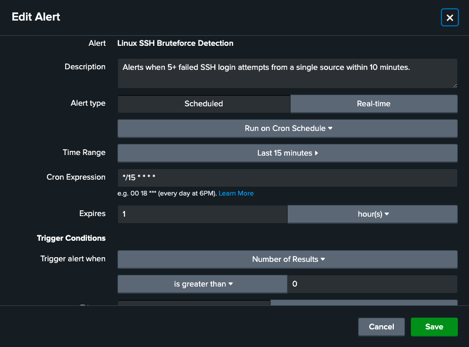
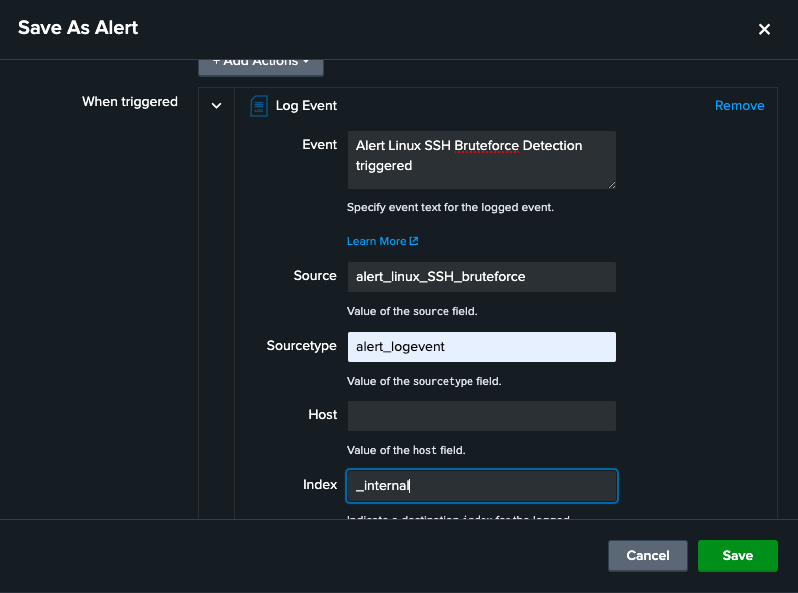

## Deployment Notes

- **Thresholds.** The `>= 5` failed-attempt threshold used across these detections was set against this sample dataset. In a live environment this would need to be validated against normal login behavior for each system, since a shared workstation or a service account can legitimately generate several failed logons in a short window.
- **Scheduling.** All four alerts are scheduled on a `*/10 * * * *` cron expression, matching the 10-minute window used in the underlying SPL.
- **Alert action.** Every alert is currently configured to log an event to the `_internal` index. In a production SOC this would instead open a ticket or push to a case management system, so an analyst is notified rather than needing to check the index manually.

## Related Work

The investigation queries that trace these detections back to a full attack timeline, including the privileged-account and root-compromise checks, are documented in the [Investigations](../Investigations) folder. The response actions taken once an alert is confirmed are documented in the [Alert Triage Playbook](../Playbooks/Alert-Triage-Playbook.md), and the full incident write-up covering containment and recovery is in the companion [Incident Response Report](https://github.com/Ihsan-Abdul/Incident-Response-Triage-Documentation).
