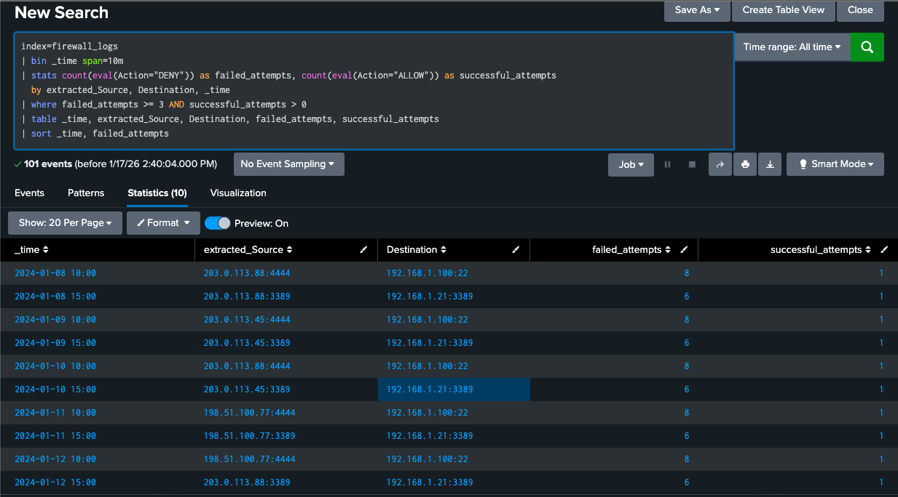

# Firewall Attack Analysis

## Overview

The firewall logs were the first data source reviewed in this investigation, since they cover every connection attempt into the network regardless of which system it targets. Reviewing five days of denied and allowed connections showed a clear brute force campaign against SSH and RDP, with the attacker succeeding on every single day of the campaign.

## What Happened

- **Morning window, 10:00 AM:** SSH brute force attempts against port 22 (also observed on port 4444, described further in the Linux analysis).
- **Afternoon window, 3:00 PM:** RDP brute force attempts against port 3389.
- **Pattern:** each window showed six to eight denied connections followed immediately by one allowed connection from the same source.
- **Duration:** January 8 through January 12, 2024, five consecutive days.

## Key Findings

### Systems Targeted

- **Linux server (192.168.1.100):** reached over SSH, with attempts also observed on the non-standard port 4444.
- **Windows server (192.168.1.21):** reached over RDP on the standard port 3389.

### Attacker Infrastructure

Three source IPs rotated across the five-day campaign:

- `203.0.113.88` — active January 8 and January 12
- `203.0.113.45` — active January 9 and January 10
- `198.51.100.77` — active January 11

### Attack Characteristics

- Every attack window ended in a successful connection. Across five days and two targeted services, the attacker was not blocked or locked out once.
- The 10:00 AM and 3:00 PM windows repeated daily without meaningful variation, which is a stronger indicator of scripted, automated activity than of a human manually retrying logins.
- The attacker returned and repeated the same pattern each day even after already gaining access, rather than establishing persistence and going quiet.

The results above show the query returning ten rows, one for each source and destination pair across the five-day window, with `failed_attempts` consistently at 6 or 8 depending on whether the target was RDP or SSH, and exactly one `successful_attempts` following each cluster of failures.

## Detection Methodology

The query bins events into 10-minute windows and counts denied and allowed connections separately for each source and destination pair, then filters down to windows where at least three denials were followed by at least one success. That combination, a run of failures immediately followed by a success, is a more reliable signal than counting failures alone, since it specifically targets the moment a brute force attempt succeeds rather than just flagging normal login noise.

[View the investigation query](spl-queries/firewall-bruteforce-investigation.spl)

## MITRE ATT&CK Mapping

- **T1110 – Brute Force:** repeated password guessing against SSH and RDP.
- **T1133 – External Remote Services:** the attacker relied entirely on internet-facing SSH and RDP rather than any other point of entry.
- **TA0001 – Initial Access:** this is the stage where the attacker first gained a foothold in the network, before any of the Windows or Linux activity documented separately.

## Mitigation Steps

1. Block the three identified source IPs at the firewall.
2. Reset credentials on both the Linux and Windows servers that were reached.
3. Apply an account lockout policy after three failed attempts, since the current environment allowed unlimited retries.
4. Reduce the internet-facing attack surface by moving SSH and RDP behind a VPN or bastion host rather than exposing them directly.
5. Require multi-factor authentication for any remote administrative access.

## Connection to Other Findings

The access gained here is the starting point for everything documented in the [Windows analysis](../windows-analysis/windows-attacks.md) and [Linux analysis](../linux-analysis/linux-attacks.md). The same three source IPs reappear in both, which is the clearest evidence that this was a single coordinated campaign rather than three unrelated attacks.
