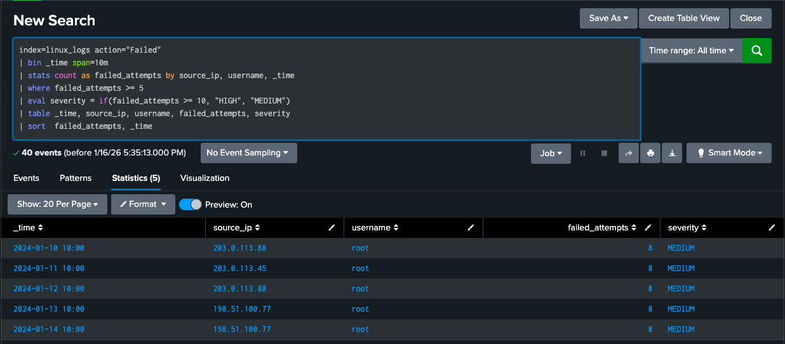
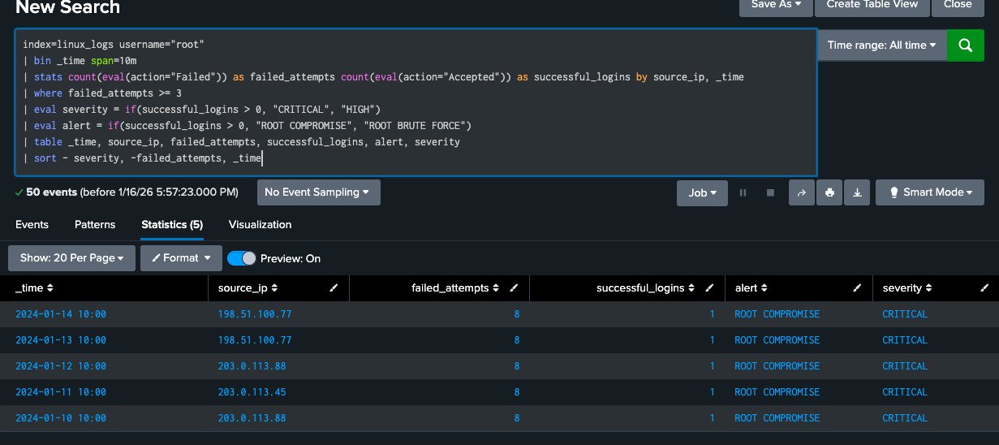
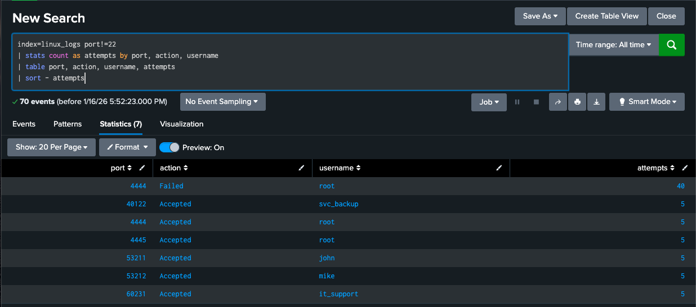

# Linux Attack Analysis

## Overview

The Linux authentication logs picked up where the firewall analysis left off. The same three source IPs from the firewall campaign showed up here, and the activity on this host escalated further than on the Windows side: the attacker reached the root account directly rather than a standard user.

## What Happened

Daily attacks from January 10 through January 14 followed a consistent pattern:

- **10:00 AM:** eight failed SSH login attempts against the root account on port 4444.
- **10:00:15 AM:** a successful SSH login on port 4445, fifteen seconds after the last failure.
- **Target:** the root account on the Linux server at 192.168.1.100.

## Key Findings

### Root Account Compromise

- Root access was obtained on all five days of the campaign, not just once.
- Every successful login followed the same eight-failure pattern, suggesting the same automated tool or script was reused each day rather than a manual retry.
- Root access gives the attacker full control of the host, which makes this the most severe finding across the three systems investigated.

The root-focused query above separates failed attempts from successful logins and flags any row where a success followed the failures as `ROOT COMPROMISE` at `CRITICAL` severity, rather than the `ROOT BRUTE FORCE` label used when the failures were not followed by a success. All five days in the dataset returned the `ROOT COMPROMISE` result, meaning the attacker never failed to get in once they started an attempt.

### Port Evasion

- The failed attempts consistently hit port 4444, while the successful logins landed on port 4445.
- Neither port is the standard SSH port (22), which means a detection built only around port 22 traffic would have missed this campaign entirely.
- This is the clearest evidence in the whole project that detection logic needs to key off behavior, in this case a burst of failed authentication followed by a success, rather than assuming attacks will only appear on the well-known port for a service.

The port analysis query filters out port 22 entirely and still returns 70 events, including 40 failed root attempts on port 4444 and five successful root logins on port 4445. It also surfaces four additional accounts (`svc_backup`, `john`, `mike`, and `it_support`) that were accessed successfully on other non-standard ports after the root compromise, which is the strongest indicator in this dataset that the attacker moved beyond the initial root access rather than stopping there.

## Detection Queries Developed

1. [Linux SSH brute force detection](spl-queries/linux-brute-force-investigation.spl) — flags any account with five or more failed SSH attempts in a 10-minute window and assigns a severity of HIGH at ten or more attempts.
2. [Root account attack detection](spl-queries/root-attacks-investigation.spl) — isolates activity against the root account specifically and distinguishes a compromise from an unsuccessful brute force attempt.
3. [Non-standard port analysis](spl-queries/linux-port-analysis.spl) — surfaces all SSH activity outside of port 22, which is what first revealed the 4444/4445 pattern.

## MITRE ATT&CK Mapping

- **T1110 – Brute Force:** password guessing against the SSH service.
- **T1078 – Valid Accounts:** the compromised root credentials were reused across five separate days.
- **T1572 – Protocol Tunneling:** the consistent use of non-standard ports for both the failed attempts and the successful login.

## Mitigation Steps

1. Disable direct root login over SSH and require administrators to authenticate as a standard user and escalate with `sudo`.
2. Move from password authentication to SSH key-based authentication.
3. Monitor SSH activity across all ports, not only port 22, since this campaign would have gone undetected under a port-22-only rule.
4. Review the SSH daemon configuration to restrict which accounts and authentication methods are permitted.

## Connection to Other Findings

The three attacker IPs and the daily timing pattern match the [firewall analysis](../firewall-analysis/firewall-attacks.md) exactly, and the root compromise documented here lines up with the credential theft and lateral movement activity in the [Windows analysis](../windows-analysis/windows-attacks.md). Taken together, the three write-ups describe one campaign moving across three systems rather than three isolated incidents.
