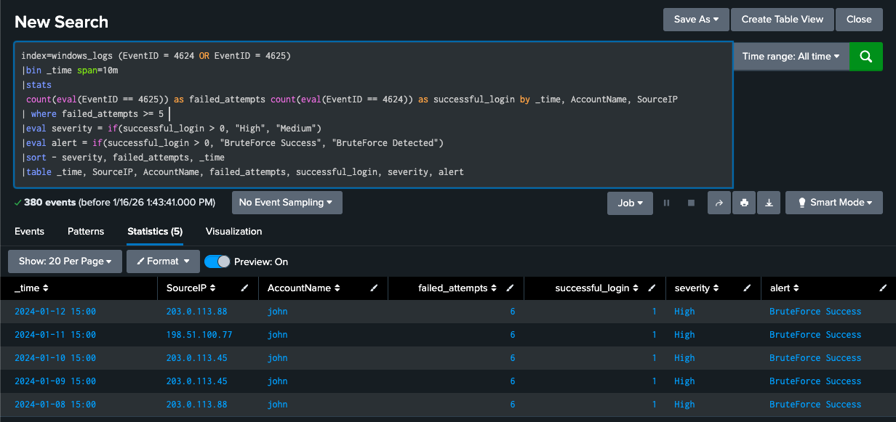
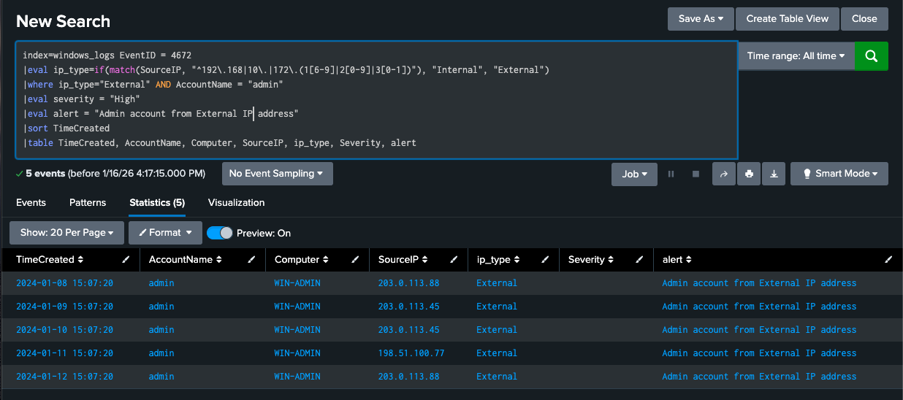
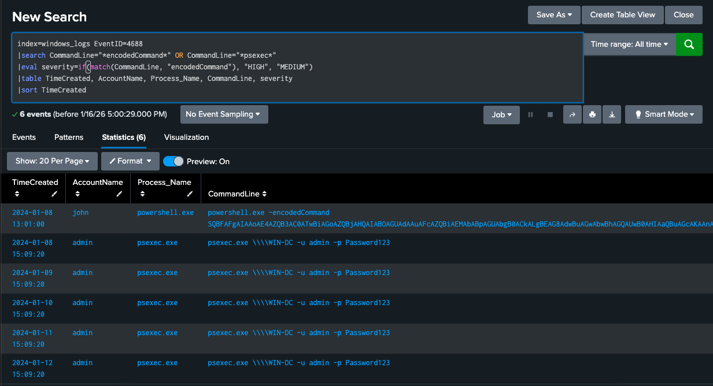

# Windows Attack Analysis

## Overview

The Windows event logs showed the most complete picture of the attack, covering everything from the initial credential compromise through to an attempted move onto the domain controller. This is the stage of the campaign where the attacker went from having a foothold to actively trying to expand it.

## What Happened

The same daily pattern repeated from January 8 through January 12:

1. **3:00 PM:** RDP brute force against the `john` account, six failed attempts followed by a success.
2. **3:07 PM:** the `admin` account authenticates from one of the three external attacker IPs.
3. **3:09 PM:** PowerShell runs with an encoded command.
4. **3:12 PM:** `psexec.exe` is used to connect to the domain controller, `WIN-DC`.

## Key Findings

### Credential Compromise

- The `john` account was compromised by RDP brute force on all five days, with a 100 percent success rate.
- The six-failures-then-success pattern is identical to what the firewall logs already showed, which is what ties this activity back to the same campaign.

The query above matches both EventID 4625 (failed logon) and EventID 4624 (successful logon), groups them by account and source IP in 10-minute windows, and flags any account with five or more failures. All five rows returned belong to the `john` account, each with six failed attempts and one successful login, which confirms the same attacker behavior seen in the firewall data was carried all the way through to a Windows authentication event.

### Privileged Account Misuse

- Seven minutes after the `john` account was compromised, the `admin` account logged in from an external IP.
- All three of the campaign's attacker IPs (`203.0.113.88`, `203.0.113.45`, `198.51.100.77`) appear here, each on a different day.
- The seven-minute gap between compromising a standard account and using an administrative one is a strong indication that the attacker used the first compromise to obtain or reuse credentials for the second, rather than brute forcing the admin account directly.

### Post-Compromise Activity

- PowerShell was executed with an encoded command roughly two minutes after the admin login, which is a common technique for obscuring the actual command being run from anyone reviewing logs casually.
- `psexec.exe` was then used to connect to the domain controller `WIN-DC` using the `admin` account.

The command line captured in this query shows the PsExec connection was authenticated with `-u admin -p Password123`, meaning the account's actual password appears in plaintext in the Windows process logs. Beyond confirming how the attacker moved toward the domain controller, this is worth flagging on its own: any credential that ends up visible in a command line is exposed to anyone who can read process history, which is an additional and avoidable risk on top of the credential simply being weak.

## Detection Queries Developed

1. [Windows brute force detection](spl-queries/windows-brute-force-investigation.spl) — flags accounts with five or more failed logons in a 10-minute window and marks the result as a brute force success if a successful login is also present.
2. [Privileged account monitoring](spl-queries/windows-privileged-account-investigation.spl) — flags any login to the `admin` account that originates from outside the internal IP ranges.
3. [Malicious process detection](spl-queries/windows-process-monitoring-investigation.spl) — flags PowerShell execution using an encoded command or the use of PsExec, both associated with post-exploitation activity.

## MITRE ATT&CK Mapping

- **T1110 – Brute Force:** RDP credential guessing against the `john` account.
- **T1078 – Valid Accounts:** reuse of the compromised `john` and `admin` credentials.
- **T1059.001 – PowerShell:** execution of an encoded command.
- **T1021.002 – SMB/Windows Admin Shares:** use of PsExec to reach the domain controller.

## Mitigation Steps

1. Enable account lockout after three failed login attempts.
2. Restrict RDP access to a VPN or jump server rather than exposing it directly.
3. Alert on any administrative account login from an external IP.
4. Review PowerShell execution logs for encoded commands as a standing detection, not just during an active investigation.
5. Establish a baseline for normal administrative activity so that unusual behavior, such as an off-hours PsExec connection to a domain controller, stands out immediately.
6. Treat any credential found in a command line or process history as compromised and rotate it immediately, regardless of how the exposure happened.

## Connection to Other Findings

The three attacker IPs and the initial access point match the [firewall analysis](../firewall-analysis/firewall-attacks.md), and the credential reuse pattern mirrors the root account compromise documented in the [Linux analysis](../linux-analysis/linux-attacks.md). Across all three systems, the attacker followed the same approach: brute force an initial account, then use that access to reach something more privileged.
